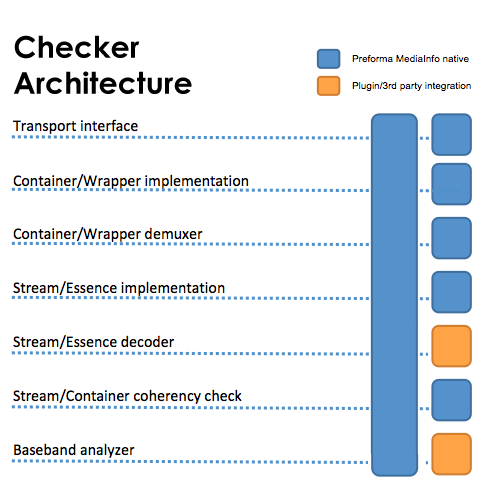

# Checker Architectural Layers

The design of the implementation checker portion of the Conch application will be comprised of several layers which will communicate via a Core controller. The layers shall include:

* Transport interface
* Container/wrapper implementation
* Container/wrapper demuxer
* Stream/essence implementation
* Stream/essence decoder (optional, through plugin)
* Stream/container coherency check
* Baseband analyzer (optional, through plugin)

## Transport layer

### Conch: File on disk or direct memory mapping

Conch uses the native file API for each operating system to enable direct file access, including files that are still in the process or being written. The inclusion of MediaInfo also offers features for direct memory mapping which will be useful for third-party development or plugins.

### Plugin integration proof of concept: libcURL

libcURL is licensed under an MIT license that is compatible with both GPLv3+ and MPLv2+. We can relicense to be under GPLv3+ and MPLv2+. curl offers extensive support for transferring data through many protocols. By incorporating curl into Conch the tool will be able to assess files that may be accessible online by providing a URL (or list of URLs) in place of a filepath.

Since we will be generating a library of reference and sample files that will include large audiovisual files, users will be able to assess reference files without necessarily needing to download them.

Used as a proof of concept of plugin integration: 
HTTP/HTTPS/FTP/FTPS support via MediaInfo open source GPLv3+/MPL2+ and libcurl (MIT license, compatible with GPLv3+/MPL2+)

## Container/Wrapper implementation checker

### Conch: Matroska checker

### Plugin integration proof of concept: mkvalidator
mkvalidator is a basic and no more maintained Matroska checker (BSD license, compatible with GPLv3+/MPL2+) which will be used mostly for demonstration of the plugin integration.

## Container/Wrapper Demultiplexing

### Conch

Conch will utilize MediaInfo's existing demuxing libraries (can be relicensed under GPL....) which will allow for PREFORMA's selected video codecs, FFV1 and JPEG2000, to be assessed from within many formats founds within archives although these container formats themselves aren't the focus of the current PREFORMA project. Through discovery interviews with archives and vendors we have found FFV1's archival implementations to use a variety of container formats such as AVI and QuickTime as well as Matroska. In order to allow developed tools to support FFV1 even if not contained within Matroska, Conch will support the following formats for demuxing (though not necessarily for conformity (yet)):

- MXF (commonly found within memory institutions)
- MOV/MP4 (often found containing FFV1, JPEG2000, and LPCM)
- DV (video stream format which uses LPCM)
- AVI (used with FFV1 by DV Profession, NOA, Austria Mediathek)
- WAV (a common container for LPCM)
- WAVE64 (64-bit extensions of WAV for 2GB+ files)
- RF64 (64-bit extensions of WAV for 2GB+ files)

By supporting the demultiplexing of these formats through MediaInfo, the developed tools will be applicable to a wide variety of files that contain PREFORMA's selected codecs: FFV1, JPEG2000, and LPCM. This demultiplexing support can be available through MediaInfo's existing libraries in a manner that is compatible with PREFORMA's licensing requirements.

### Plugin integration proof of concept: FFmpeg

FFmpeg is one of the most ubitiquous, comprehensive, and open tools for demultiplexing and decoding audiovisual data; however, although FFmpeg's GPLv2+ license is compatible with PREFORMA's selected GPLv3+ license, it is not compatible with PREFORMA's other selected license, MPLv2+. As the PREFORMA conformance project evolves to support additional formats and codecs through plugins the use of FFmpeg's features are expected to becoming more and more appealing.

Although Conch won't incorporate FFmpeg in order to comply with the MPLv2+ licensing requirement, we would like to design plugin support for FFmpeg. In this way a memory institution using Conch could separately download FFmpeg and link the two together to enable additional tools such as:

## Stream/Essence implementation checker

Plugin

### Conch:

- FFV1
- PCM (including D-10 Audio, AES3)

### Plugin integration proof of concept: jpylyzer
For JPEG 2000 (GPLv3+ license, compatible with GPLv3+ but not with MPL2+)

### Plugin integration proof of concept: DV Analyzer
For DV (BSD license, compatible with GPLv3+ and MPL2+)

### Optional 

(Not part of the original PREFORMA tender but can potentially be added upon request after in context of professional services)

- MPEG-1/2 Video (including IMX, AS-07, D-10 Video, FIMS…)
- H.264/AVC (including AS-07)
- Dirac
- AC-3 (including AS-07)
- MPEG 1/2 Audio
- AAC
- Any other essence format on sponsor request (we have skills in DV, VC-1, VC-3, MPEG-4 Visual, H.263, H.265/HEVC, FLAC, Musepack, Wavepack, , BMP, DPX, EXR, JPEG, PNG, SubRip, WebVTT, N19/STL, TTML…)

## Stream/Essence decoder

(Not part of the original PREFORMA tender but can potentially be added upon request after in context of professional services)

### Conch

- PCM (including D-10 Audio, AES3)

### Plugin integration proof of concept: FFmpeg
FFmpeg decoder (GPLv2+ license, compatible with GPLv3+ but not with MPL2+)

For instance the integration of FFmpeg can provide integration of very comprehensive decoding and demultiplexing support beyond what can be easily provided with MediaInfo's demuxing libraries. FFmpeg's libavfilter library also provides access to waveform monitoring, vectorscope, audio meters, and other essential audiovisual inspection tools.

- Video Waveform Monitor
- Vectorscope
- Ability to inspect luminance and chroma planes separately
- Audio Meters

We anticipate that the implementation of FFmpeg plugin support will substantially simplify the development of other plugins for broader codec and format support so that an entire decoder or demuxer does not need to be written from scratch in order to extend support.

### Plugin integration proof of concept: OpenJPEG
OpenJPEG decoder (BSD license, compatible with GPLv3+/MPL2+)

## Container/Wrapper vs Stream/Essence Coherency Check

### Conch
Conch will support the coherency check between all suppoted formats (see Container/Wrapper implementation checker and Stream/Essence implementation checker parts)

## Baseband Analyzer

### Conch

- None (only creation of the API)

### Playback and Playback Analysis (through plugin)

Note that the PREFORMA tender does not require decoding or subsequent baseband analysis or playback; however, from our experience in implementation checker design with DV Analyzer and QCTools and through discovery interviews, we've found that users are quick to require some form of playback in order to facilitate decision-making, response, and strategies for fixing. For instance if the implementation checker warns that the Matroska container and FFV1 codec note contradictory aspect ratios or a single FFV1 frame registers a CRC mismatch it is intuitive that the user would need to decode the video to determine which aspect ratio is correct or to assess the impact of the CRC mismatch. These layers can be supporting by designing a implementation checker and shell that is prepared to utilize FFmpeg as an optional plugin to enable additional analysis features and playback. Our overall proposal is not dependent on supporting an FFmpeg plugin but we believe that preparing a implementation checker that could support FFmpeg as an optional plugin could create a more intuitive, comprehensive, and informed user experience.

We propose incorporating several compatible utilities into Conch to extend functionality and add immediate convenience for users. Each component is built as a plugin and can be replaced by a third party tool.

### Plugin integration proof of concept: QCTools
QCTools graphs (report on and graph data documenting video signal loss, flag errors in digitisation, identify which errors and artifacts are in original format and which resulted from the digital transfer based on all the data collected in the past.)
