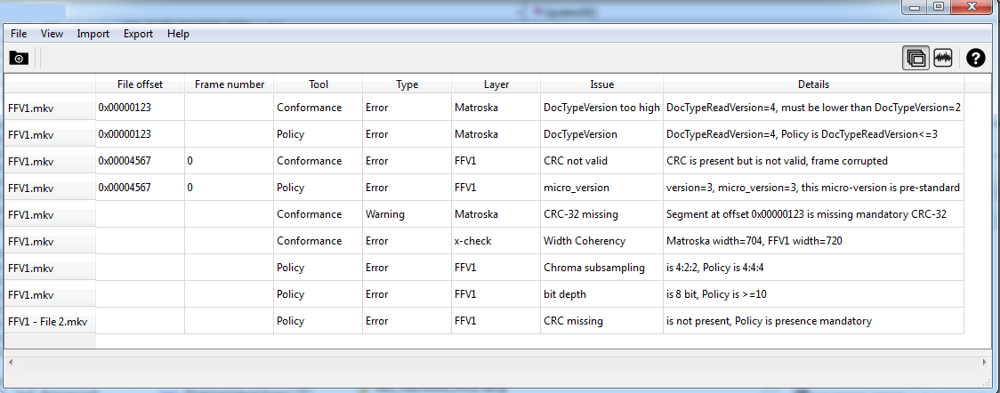
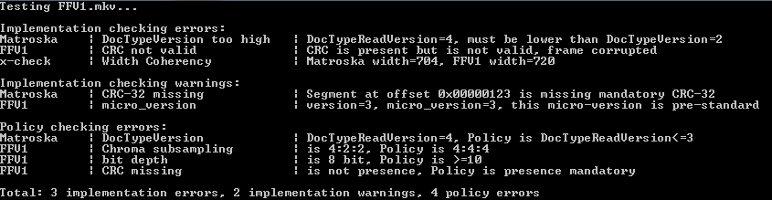
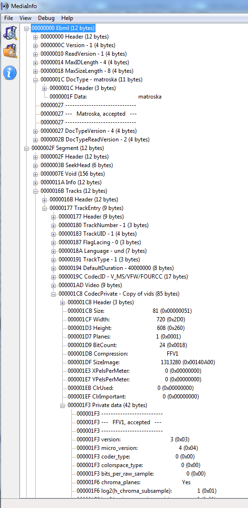
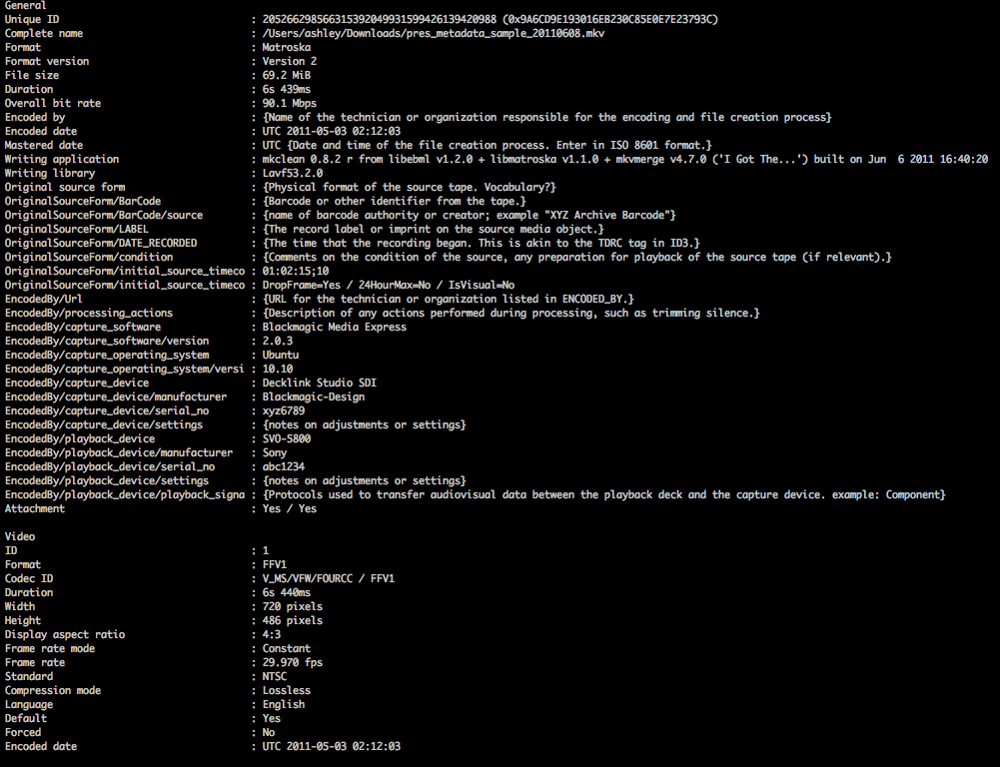

## Project Introduction

The PreForma challenge illuminates and responds to a significant and real obstacle that faces the preservation community today. This report encompasses a snapshot of MediaArea's design plans to create a toolset (tentatively entitled "PreForma MediaInfo") as the conformance checker, policy checker, reporter, and fixer of a select list of formats.

As preservation workflows have incorporated digital technology, significant amounts of careful research have gone into the selection of file format recommendations, lists of codec specifications, and development of best practices; however, despite the existence of such recommendations, there remains a lack of assessment tools to verify and validate the implementation of such recommendations. A few validation tools (such as mkvalidator) are produced alongside the development of their associated standards; however, most file format specifications are not officially tied to any validation tool and are documented through human-readable narrative without equivalent computer-actionable code. Where a metadata standard may be described in both a data dictionary and a computer-usable XML Schema, file formats standards often lack a computer-usable verification method. The PreForma project recognizes this discrepancy and the resulting long-term impacts on archival communities and seeks to fill in the gaps necessary to provide memory institutions with levels of control to verify, validate, assess and repair digital collections.

MediaArea's approach to this challenge centers on Free Software, modular design, and interoperability and will rely strongly on MediaInfo (an open source MediaArea product) to meet this challenge. MediaInfo is often advised as the first tool to use when a media file is not playable, allowing the user to identify characteristics that would help find an appropriate playback or transcoding tools. MediaInfo’s open licensing and agility in technical metadata reporting have encouraged its integration into several archival repository systems and OAIS workflows to assist archival with technical control of collections.

MediaArea sees community involvement as a key factor of evaluating the success of the project. To encourage this, during the prototype phase MediaArea will perform the development work for command line utilities, graphical user interfaces, and documentation in publicly accessible repositories at github.com. We will set up an online set of project resources such as public access to a corpus of test media, an IRC channel, and a responsive public issue tracker.

## Introduction of Featured Formats

During the development phases MediaArea will focus on one container format, Matroska, and two streams, LPCM and FFV1. The design work of MediaArea will address formats and codecs through a modular architecture so that other formats or codecs may easily be added alongside or after development.

Matroska, FFV1, and LPCM describe very unique concepts of information including:

- a container format, Matroska
- an audio stream, LPCM
- a video stream, FFV1

These three information concepts will inform distinct user interface and reporting design in order to process these concepts through differing strategies. For instance reporting on the status of 100,000 of video frames within a video recording may be done more efficiently in a different interface as one designed to communicate the hierarchical structure of a file format.

Additionally other formats currently being addressed by PreForma fit within these three conceptual categories; for instance, PDF and TIFF are formats (containers) and JPEG2000 is a video stream. These three concepts affect the design of an overall application shell as conformance information for each category can have its own optimized user interface.

### Matroska

Matroska is a open-licensed audiovisual container format with extensive and flexible features and an active user community. The format is supported by a set of core utilities for manipulating and assessing Matroska files, such as mkvtoolnix and mkvalidator.

Matroska is based on EBML, Extensible Binary Meta Language. An EBML file is comprised of one of many defined "Elements". Each element is comprised of an identifier, a value that notes the size of the element's data payload, and the data payload itself. The data payload can either be stored data or more nested elements. The top level elements of Matroska focus on track definition, chapters, attachment management, metadata tags, and encapsulation of audiovisual data. The Matroska element is analogous to QuickTime's atom and AVI's chunk.

Matroska integrates a flexible and semantically comprehensive hierarchical metadata structure as well as digital preservation features such as the ability to provide CRC checksums internally per selected elements.

### FFV1

FFV1 is an efficient lossless video stream that is designed in a manner responsive to the requirements of digital preservation. Version 3 of this lossless codec is highly self-descriptive and stores its own information regarding field dominance, aspect ratio, and colorspace so that it is not reliant on a container format to store this information (other streams that rely heavily on its container for technical description often face interoperability challenges).

FFV1 version 3 mandates storage of CRCs in frame headers to allow verification of the encoded data and stores error status messages. FFV1 version 3 is also a very flexible codec allowing adjustments to the encoding process based on different priorities such as size efficiency, data resilience, or encoding speed.

### Linear PCM

Linear Pulse Code Modulation (LPCM) is a ubiquitous and simple audio stream. PCM audio streams may be comprised of signed or unsigned samples, arranged in little-endian or big-endian arrangements, in any number of audio channels. PCM is very flexible but is not self-descriptive. A raw PCM file can not properly be decoded without knowing the sample encoding, channel count, endianness, bit depth, and sample rate. PCM is typically dependent on its container format (such as WAV) to store sufficient metadata for its decoding.

Because PCM streams contain only audio samples without any codec structure or metadata within the stream, by itself any data could be considered valid PCM and decoded as audio. Determining the conformity or technical health of PCM data requires the context of information provided by its container format.

## Development of a Conformance Checker

The design of the conformance checker is intended to allow interoperability between the conformance checkers with PreForma's other suppliers so that users may integrate multiple conformance checkers within a single 'shell'. The conformance checker is comprised of four components:

- implementation checker
- policy checker
- reporter
- metadata fixer

The conformance checker developed within the PreForma project must document and associate conformance rules with data types (such as formats, streams, frames, etc) and authorities (such as specifications, community practices, or the local rules of a memory institution). MediaArea recommends that communication between the conformance checker and the shell be performed through an API designed via collaboration of the PreForma suppliers.

### Implementation Checker

Each implementation checker (for Matroska, FFV1, and LPCM) should assess compliance and/or deviation between files and a series of conformance checks which are written by dissecting rules and logic from each format's underlying specifications, including rules that may be deduced or inferred from a close reading of the specification or related authoritative documentation. MediaArea has drafted registries of conformance rules within the PreForma design phase and plans to collaborate with each format's specification communities to refine them. See the [Conformance Check Registry](#conformance-check-registry).

For streams such as FFV1 some implementation checks may be performed frame-by-frame to discover frame-specific issues such as CRC mismatches, invalid frame headers, or incomplete frames. Frame-by-frame implementation assessments will naturally be time consuming as nearly the entire file must be read. In order to accommodate user's various time priorities the implementation checker will use options to perform implementation checks on the first few frames of a stream, a percentage of the frames, or all of the frames.

MediaArea has drafted a [registry](#conformance-check-registry) of metadata elements to be used in described an implementation conformance check, which provides unique identifier, the scope, and underlying rationale and authority for the check. Code created to preform implementation checks will be internally documented with references to conformance check's unique identifiers, so that MediaArea may create resources for each conformance check that relate the identity of the check, its underlying authority, sample files, and associated code.

### Policy Checker

For each format addressed through a conformance checker MediaArea will create a vocabulary list of technical metadata and contextual descriptions. Additionally MediaArea will define a list of operators to enable various comparators between the actual technical metadata and the user-provided expected metadata. Such defined language will allow users to make policy check expressions such as:

- FFV1.gop_size MUST_EQUAL "1"
- FFV1.slice_crc MUST_BE_ENABLED
- FFV1.version GREATER_THAN_OR_EQUAL "3"
- MKV.tag.BARCODE MUST_START_WITH "ABC"
- MKV.tag.DATE_DIGITZED IS_BEFORE "2014-01-01"
- MKV.tag.ISBN MATCHES_REGEX "(?=[-0-9xX ]{13}$)(?:[0-9]+[- ]){3}[0-9]*[xX0-9]$"

MediaArea proposes that PreForma suppliers collaborate to define a common expression for sets of policy checks via an XML Schema, associated data dictionary, and vocabulary of comparative operators. The collaboration would include agreement and definition on the operators ("Greater Than", "Starts With", etc) of the policy checks and attempts to normalize technical metadata between common formats where they have overlapping concepts. Each policy checker would produce a vocabulary of technical metadata specific to its format for policies to be checked against as well as inclusion within an API so that the shell can access the possible operators of any enabled conformance checker.

MediaArea will provide sample sets of policy checks based on interviews with memory institutions and community practice.

### Reporter

MediaArea proposes that PreForma suppliers collaborate to create a common XML Schema to define the expression of PreForma reporting (referred to here as "PreFormaXML"). The schema should define methods to express technical metadata and relates checks to formats/streams (including components of formats and streams such as frames or attachments). The XML Schema should encompass not only information about the files being assessed but also the conditions and context of the particular use (which shell was used, with what policy sets, at what verbosity, etc). The XML Schema should be supported by a data dictionary that is also collaboratively written by PreForma suppliers. MediaArea anticipates that the implementations and features performed upon the basis of a common XML Schema may vary from supplier to supplier or per conformance checker, but that adherence to a common schema is essential to interoperability and consistent user experience amongst conformance checkers.

The PreFormaXML schema should accommodate the expression of results from multiple conformance checkers upon a single file. For instance a Matroska file that contains a JPEG2000 stream, a FFV1 stream, and a LPCM stream should be able to express one XML element about the file with sub-elements about each conformity check to reduce redundancy.

MediaArea plans to include these features commonly within MKV, FFV1, and LPCM reporters:

- Export of a standardized PreFormaXML
- Export PreFormaXML with gzip compression (to reduce the impact of large and highly verbose XML files)
- Export of the same data within a semantically equivalent JSON format
- Other functions based on PreFormaXML (such as generation of PDF formats or summarization of multiple collections of PreFormaXML) will happen within the "Shell" component

### Fixer

MediaArea will produce a fixer that allows for editing the file. Enabling this function will be performed with a substantial amount of caution as in some cases a user could use it to change a file considered a preservation master. The fixer will support assessing a file first to determine the risk of editing a structurally unhealthy file and provide suitable levels of warning to the user.

The metadata fixer shall support both direct editing on the input file (with warning) or producing a new output file as a copy that the metadata change as requested.

The metadata fixer will support comprehensive logging of the change and offer options to log the performance of the edit itself with the file if it has a means to accommodate it (such as Matroska).

In addition to metadata manipulation the fixer will accommodate structural fixes to improve the structural health of the file, such as repairing Matroska Element order if ordered incorrectly, or validating or adding Matroska CRC Elements at selected levels, or fixing EBML structures of truncated Matroska files.

Substantial care should be exercised to ensure that the Conformance Checker properly associates risk, user warnings, and assessments with each fix allowed. In order to allow a fix the software must properly understand and classify what may be fixed and be aware of how the result may be an improvement. Adjustments directly to a preservation file must be handled programmatically with great caution with diligent levels of information provided to the user.

An example of a fix that could be enabled in the RIFF format could be verifying that any odd-byte length chunk is properly followed by a null-filled byte. Odd-byte length chunks that do not adhere to this rule cause substantial interoperability issues with data in any chunk following the odd-byte length one (this is particularly found in 24 bit mono WAV files). If the odd-byte length chunk is not followed by a null-filled padding byte, then most typically the next chunk starts where the padding byte is and the padding byte may be inserted so that other following chunks increase their offset by one byte. This scenario can be verified by testing chunk id and size declaration of all following bytes so that the software may know beforehand if the fix (inserting the null-filled padding byte) will succeed in correcting the RIFF chunk structure’s adherence to its specification.

Fixes for Matroska files could include fixing metadata tags that don’t include a SimpleTag element or re-clustering frames if a cluster does not start on a keyframe.

Because many files focused on with FFV1 and Matroska conformance checkers will be quite large, MediaArea plans to provide options to either rewrite the original file with the check or edit the file in place so that the file is only changed according to the fix that is request. With the latter option is the user is 'fixing' the metadata in a 50 gigabyte Matroska file only the last few megabytes of the Matroska tagging element may be rewritten without a requirement to rewrite the non tagging elements at the beginning of the file (MediaArea deployed a similar feature within BWF MetaEdit).

### Shell

The shell will coordinate the actions of the implementation checker, policy checker, reporter and fixer. As PreForma seeks that the shell developed by each supplier supports each supplier's conformance checker(s), MediaArea encourages all suppliers to work collaboratively to negotiate API documentation to support not only our own interoperability but to support third-party development of additional conformance checkers to utilize the produced shells.

The development of the shell will strive to facilitate an intuitive and informed use by memory institutions at both expert and non-expert levels. The shell will include substantial internal documentation that mimics the online resources that we will provide so that the shell and conformance checker function well offline.

MediaArea will implement a scheduling service within the shell so that large tasks may be performed overnight or according to a defined schedule. MediaArea will enable the Shell to load queues of files from lists of filepaths or URLs. Because of the size of data involved in audiovisual checkers MediaArea will give priority to designing the shell and conformance checker to perform multi-threaded and optimized processing.

#### Implementation Checker (Shell)

The shell produced will support all functions and requirements of the implementation checker as described as an independent utility and also support:

- Allow the user to open one or many files at a time.
- Allow the user to queue simultaneous or consecutive file analysis.
- Allow the user to select how comprehensive or verbose an implementation check may be (for instance, samples frames or all frames of video).
- Enable the user to select sections of conformance checks or sets of conformance checks that they may wish to ignore.
- Enable the user to associate certain actions or warnings with the occurence of particular checks.
- Provide feedback and status information live during the file analysis.
- (For Matroska) Present a user interface that displays the hierarchical EBML structure of the file with the corresponding policy outcome for each policy check.
- (For FFV1) Present a user interface that displays frame metadata in a table and enable the user to filter the presentation of frame metadata according to warnings or coherency events (for example, discontinuous aspect ratio).

#### Policy Checker (Shell)

The shell produced will support all functions and requirements of the policy checker as described as an independent utility and also support:

- Allow PreForma-supported technical metadata vocabularies to be imported or synchronized against an online registry.
- Provide an interface for the user to import, create, edit, or export a valid set of policy checks.
- Implement selected set of policy checks on all open files or selected files.
- Present the outcome of policy checks in a manner that allows comparison and sorting of the policy status of many files.
- Allows particular sets of policy to be associated with particular sets of files, based on file identification or naming patterns.
- (For Matroska) Present a user interface that displays the hierarchical EBML structure of the file with the corresponding policy outcome for each policy check.

#### Reporter (Shell)

The shell produced will support all functions and requirements of the reporter as described as an independent utility and also support:

- Export of the PreFormaXML data at user-selected verbosity levels in a PDF format, which data visualizations supplied where helpful.
- Ability to read a collection of PreForma XML documents and provide a comprehensive summary and technical statistics of a collection to allow for prioritization, comparison, and planning.

#### Fixer (Shell)

The shell produced will support all functions and requirements of the reporter as described as an independent utility and also support:

- Allow for single file or batch editing of file format metadata.
- Allow for selected metadata to be copied from one file to another or from one file to all other open files.
- Allow for file format metadata to be exported and imported to CSV or XML to enable metadata manipulation in other programs to then be imported back into the Shell and applied to the associated files.
- (For Matroska) Present a user interface that displays the hierarchical EBML structure of the file and allows the user to create, edit, or remove (with warning) any EBML element and display the associated policy or implementation check that corresponds with such actions.

#### Interfaces

The selected formats (MKV, FFV1, and LPCM) represent substantially distinct concepts: container, video, and audio. The optimization of a conformance checker should utilize distinct interfaces to address the conformance issues of these formats, but allow the resulting information to be summarized together.

Assessment of file conformance can be displayed via a graphical user interface or a command line interface.

An interface for assessing conformance of FFV1 video could enable review of the decoded FFV1 frames (via a plugin) in association with conformance data so that inconsistencies or conformity issues may be reviewed in association of the presentation issues it may cause.

MediaArea proposes an interface to present conformity issues for audio and video streams (FFV1 and LPCM) on a timeline, so that conformance events, such as error concealment or crc validation issues may be reviewed effectively according to presentation, parent Matroska block element, or video frame.

For deep analysis, a distinct interface that allows for its hierarchical structure to be reviewed and navigated. The presentation should allow for MKV and FFV1 elements to be expanded, condensed, or filtered according to element id or associated conformity issues.

A summary of the file properties can also be displayed via a command line interface for quick reference or export.

### Optimization for Large File Size

Design of a conformance checker and shell should be considerate of the large file sizes associated with video. For instance, an hour-long PAL FFV1 file (which contains 90,000 frames per hour) should provide efficient access if cases where one FFV1 frame contains a CRC validation error.

A video conformance checker should be well optimized and multi-threaded to allow for multiple simultaneous processes on video files. Additionally the conformance checker should allow a file to be reviewed even as it is being processed by the conformance checker and allow assessment of files even as they are being written.

### Focus on Fixity

Both FFV1 and Matroska provide fixity features that serve the objectives of digital preservation by allow data to be independently validated without the requirement of managing an external checksumming process. FFV1 version 3 mandates CRCs on each frame. Matroska documents methods to embed checksums in Matroska elements to allow for future validation of any content.

Although the Matroska specification states that "All level 1 elements should include a CRC-32" this is not the practice of most Matroska multiplexers. As part of the Fixer aspect of this project, MediaArea proposes to develop a conformance checker that allows users to add CRC-32 to selected elements.

The advantages of embedded fixity in preservation media files are significant. The use of traditional external checksums does not scale fairly for audiovisual files, because since the file sizes are larger than non-audiovisual files there are less checksums per byte, which creates challenges in addressing corruption. By utilizing many checksums to protect smaller amounts of data within a preservation file format, the impact of any corruption may be associated to a much smaller digital area than the entire file (as the case with most external checksum workflows).

### Reference and Test Files

MediaArea anticipates creating a large library of reference files that highlight many of the issues documented in our conformance check registry. Such files will be release under PreForma's selected open licenses. Additionally we will curate references to relevant files in other reference libraries:

- Selections from http://samples.ffmpeg.org
- PDF/A files buggy files: http://www.pdfa.org/2011/08/isartor-test-suite/
- JPEG 2000 files: https://github.com/openplanets/jpylyzer-test-files
- Matroska buggy files: Homemade + request to Matroska mailing list
- FFV1 buggy files: Homemade + request to FFmpeg mailing list
- LPCM files: Homemade

## Intended Behavior by Use Case

### Overview

The following use cases are presented to describe intended behaviors of the conformance checker:

#### Conformance Checking in an Open Archival Information System (OAIS)

MediaArea recognizes the recommended practices described in the Open Archival Information System (OAIS) reference model, intended to provide long term preservation of digital information (CCSDS 650.0.-M-2). The stated conformance checker should be developed to address all relevant areas of activity within the OAIS model, as well as minimize and/or mitigate any incompatibility with additional OAIS-related standards.

Conformance checking plays a major role in OAIS-type services through the Information Packages created by Producers, maintained by Management in the Archive, and later, retrieved and put to use by Consumers and/or Designated Community. To take an example of such a service model, the Ingest Functional Entity of OAIS, or Ingest, performs quality assurance on incoming Submission Information Packages (SIPs). The conformance checker, as both an implementation and policy checker, would serve as the primary tool to verify SIPs and other submitted Preservation Description Information (PDI), with rules and specifications defined by the Archive. As Archival Information Packages (AIPs) are generated for the Archive, a conformance checker would map all Transformations through the collection of associated Representation, Content, and PDI information. And upon a dissemination request, reports created by the conformance checker would be used as descriptive information needed for the processing of objects for the Dissemination Information Package (DIP). 

The conformance checker in effect resembles a complex Representation Net in the OAIS Archive, providing information needed to adequately understand the proper playback of the associated data object. 

### Conformance Checking at Digitization Time

#### Verification of Digitization Policy

Archival digitization workflows are generally highly defined and consistent so that various analog source objects are associated with particularly digitization requirements. Generally digitization specifications are selected in order to reduce alterations to the significant characteristics of the analog source material. Example of such digitization scenarios may be:

- A PAL Betacam SX tape is digitized to a Matroska/FFV1 file at PAL specifications with YUV 4:2:2 8 bit video and 4 channels of 24 bit LPCM audio
- A NTSC U-Matic tape is digitized to a Matroska/FFV1 file at NTSC specifications with YUV 4:2:2 10 bit video and 2 channels of 24 bit LPCM audio
- A 1/4" audio reel is digitized to a 2 channel 96000 Hz, 24 bit audio LPCM file
- A CD-R is ripped to a 44100 Hz, 16 bit, 2 channel LPCM file
- A DAT tape is ripped to either a 32000, 44100, or 48000 Hz 16 bit file

Such digitization requirements may be expressed into a policy checker set through the shell or policy checker to verify that the results of digitization are consistent with the archive's specifications. This includes both sets of technical metadata and specification as well as anticipated embedded descriptive, preservation, or administrative metadata.

#### Verification of Lossless Digitization

Until recently audiovisual digitization required a fairly inflexible set of hardware requirements and extremely limited possibilities for an open source approach to video digitization. Due to the bandwidth and processing requirements for the digitization of standard definition video required the installation of PCI cards and often the use of hardware encoders that were designed to encode video as fast as the video was being received to codecs like MPEG2 or JPEG2000. With modern connectivity options such as USB 3 and Thunderbolt it is easier to add video digitization capabilities to modern computers and more archive are performing this internally. Additionally modern computer processers can now transcode video losslessly in software from a video input without the need to rely on proprietary hardware-based encoders. Open source solutions such as DVA Profession, bmdcapture, and FFmpeg along with the open provision of video digitization software development kits, such as the Blackmagic SDK are facilitating new open development projects for archival video digitization.

As vendors and memory institutions are increasing considering and implementing digitization workflows that encode video directly to lossless codecs without the use of an intermediate file-based uncompressed audiovisual data, it is increasingly crucial to assess this lossless file soon after creation to detect any flaws within the digitization process.

For those digitizing video through processes that incorporate libav or FFmpeg such as bmdcapture of FFmpeg's decklink integration, a separate framemd5 may be written alongside the encoded ffv1 data. The resulting ffv1 data may then be verified against the framemd5 to verify that the correct bits were written to disk.

An inspiration for the use of framemd5 reports within a digitization workflow is inspired by the verify option with the flac utility available at http://flac.sourceforge.net/. The ‘-V’ or –verify command is used to decode the encoded stream in parallel to the encoding process to double-check the losslessness of the transcoding. With this method any discrepancy between what data is read and transcoded versus what data is written to disk could be identified in a subsequent verification process. The use of framemd5 data within a digitization workflow enables verification in cases where an option similar to flac's --verify argument isn't available.

#### Assessment of Vendor/Producer Deliverables

For archives that clarify specifications for audiovisual digitization projects, the conformance checker should facilitate a workflow for the archivist to express those specifications and verify received material against them. In addition to testing for the presence and order of required metadata tags the conformance checker should also be able to verify that they adhere to particular patterns as expressed through regular expressions.

The conformance checker should be able to verify that files were transferred completely and that the delivered material does not contain any partial files from an incomplete or aborted transfer.

The implementation and policy checker's reporting on deliverables will enable the user to provide specific feedback to the vendor or producer to create files with greater compliance or coherency.

### Conformance Checking at Migration Time

#### Fixity Verification

Migration of large amounts of data introduces risk for digital corruption and/or sector loss. Ongoing data migration is essential for digital preservation but can require a time consuming verification process. Both Matroska and FFV1 contain features for internal fixity so that a file copied from point A to point B can be assessed at point B alone to verify the data integrity of the frames. MediaArea recommends using Matroska's CRC features for use in digital preservation to allow for fixity verification to be more stable and achievable with the file alone without necessarily depending on external databases or records of checksums.

#### Obsolescence Monitoring

Migration is typically an ideal time to perform obsolescence monitoring and preparing actions to limit complications in obsolescence status. Just as memory institutions must maintain the technology that their physical collections are dependent upon, this is equally true for digital collections. As this maintenance becomes more complex, costly, or unlikely archives will typically reformat material (with as little compromise to the content and characteristics of the source as possible) to a format that has more sustainable characteristics.

To counteract arising obsolescence challenges it is critical to have access to thorough sets of technical metadata in order to associate certain codecs, formats, or technologies with sustainability risks or to identify what one format should be superseded by another in a particular digital preservation. For instance an institution that utilized FFV1 version 0 as a lossless preservation codec may wish to identify such files to reformat them to FFV1 version 3 (now that it is non-experimental) in order to take advantage of version 3's additional advantages. In our research one archive found that some digitized material received from a vendor was missing technical metadata about field dominance and had to identify exactly which materials were affected to order to rectify the issue.

## The team and roles

- Jérôme Martinez (Digital Media Specialist): technical design, implementation of the bytestream/bitstream analyzer, extraction of metadata.
- Dave Rice (Archivist): communication with memory institutions, definition of tests, documentation.
- Guillaume Roques (Back end / Front end developer): database management, automation, performance optimization, reporting, shell.
- Moritz Bunkus (Matroska main developer): validation of Matroska tests, Matroska specific technical support
- (Name to be confirmed) : validation of FFV1 tests, FFV1 specific technical support

## Open Source Ecosystem

### Cross Platform Support

MediaArea excels in open source development for cross-platform support and chooses development frameworks and tools that enable cross-platform support to be maintained. Several applications developed by MediaArea such as QCTools, MediaInfo, and DVAnalyzer are available under nearly all major operating systems. To achieve this we will program in C++ and use the Qt application framework.

For an impression of MediaArea's focus on cross platform usability please see our download pages:

- http://mediaarea.net/en/MediaInfo/Download
- http://bavc.org/qctools-downloads

MediaInfo is also officially provided by multiple open source distributions:

- Debian: https://packages.debian.org/wheezy/mediainfo
- Ubuntu: http://packages.ubuntu.com/utopic/mediainfo
- RedHat / Fedora: https://apps.fedoraproject.org/packages/mediainfo
- OpenSuse: http://packman.links2linux.org/package/mediainfo
- Arch Linux: https://www.archlinux.org/packages/?q=mediainfo
- FreeBSD: http://www.freshports.org/multimedia/mediainfo/
- Homebrew (open source software package management system for Mac): http://brewformulas.org/MediaInfo

### Online Resources

MediaArea will utilize GitHub as a social and development center for PreForma MediaInfo development and uses GitHub's issue tracker and wiki features alongside development.

For communication MediaArea will establish public mailing lists and an IRC channel for foster support and involvement from memory institutions.

MediaArea will solicit, create, and accept test files and reference files that highlight various features of the conformance checker and illustrate likely preservation issues that may occur within the selected formats.

### Community Interviews

In December 2014, MediaArea started conducting interviews with FFV1, Matroska, and LPCM stakeholders in order to collect feedback and insights from the archives community.  To date, interviews have been conducted with:

- Hermann Lewetz, Peter Bubestinger; Österreichische Mediathek
- Ian Henderson; UK National Archives
- Christophe Kummer; NOA
- George Blood; George Blood, L.P.

Notes and partial transcripts (in English) from the interviews are available in the MediaInfo PreForma GitHub repository.  Public release of interviews is pending complete transcriptions and review of transcriptions by all participants in order to ensure accuracy and compliance with Creative Commons CC-BY 4.0.  The interviewees' feedback will help inform MediaArea's approach to development in all areas, and especially reinforced our plans to standardize the FFV1 specification through an open source standards organization

### Advance Improvement of Standard Specification

#### FFV1 Specification

Efforts to create an FFV1 specification began in April 2012, continuing through the August 2013 release of FFV1 version 3. Currently the specification remains in development at http://github.com/ffmpeg/ffv1. Ideally a specification should fully inform the development of a decoder or parser without the need to reference existing implementations (such as the ffv1 implementations within ffmpeg and libav); however MediaArea's initial research and prototyping efforts with FFV1 found the current specification insufficient to create a decoder. As a result MediaArea utilized ffmpeg’s FFV1 implementation to fully interpret the specification. Several threads on the ffmpeg-devel and libav-devel listserv reference discussions about the development of the FFV1 specification and consideration of efforts to standardize the specification through a standards organization, such as IETF (Internet Engineering Task Force) [1].

In consideration of FFV1’s utilization within preservation contexts, the standardization of the codec through an open standards organization would better establish FFV1 as a trustworthy, stable, and documented option. In MediaArea's interviews with FFV1 adopters, interviewees noted that FFV1's current status proved problematic in gaining organizational buy-in for adoption of FFV1. Additionally, standardization of FFV1 would increase awareness of and interest in FFV1. This increased visibility is vital to engaging an overly cautious archives community. At the moment FFV1 can be seen at a tipping point in its use within preservation context. Its speed, accessibility, and digital preservation features make it an increasingly attractive option for lossless video encoding that can be found in more and more large scale projects; the standardization of FFV1 through an open standards organization would be of broad interest to digital preservation communities and facilitate greater accessibility of lossless encoding options that are both efficient and standardized.

MediaArea proposes working closely with the lead authors of the FFV1 specification in order to update the current FFV1 specification to increase its self-reliance and clarity. Development of the FFV1 specification early within the PreForma project will generate substantial feedback to the authors of the specification which could then be offered through the specification’s github page via pull requests or the issue tracker. MediaArea proposes at a later stage of development that the Preforma project serve as a catalyst to organize, facilitate, and sponsor the IETF standardization process for FFV1.

Considering the two-year timeline of the PreForma project and usual pace of IETF standardization projects, we propose at least submitting FFV1 as an Independent Submission to IETF that could provide workable timeline, encourage a detailed review process, and assign a formal RFC number to the specification.

[1]: http://www.ietf.org/

#### Matroska Specification

Both the Matroska specification and its underlying specification for EBML are at mature and stable stage with thorough documentation and existing validators, but several efforts of the PreForma project can serve as contributions to this specifications. The underlying EBML specification [2] has already been drafted into RFC format but is has not yet been submitted to IETF as an Independent Submission or otherwise. MediaArea recommends that PreForma play a similar catalyst role for further standardization with Matroska as well, helping enable the refinement of the current RFC draft and coordinating an IETF process.

Matroska has a detailed metadata specification at http://www.matroska.org/technical/specs/tagging/index.html. Each tag has an official name and description while provides rules and recommendations for use. Many of these tags could be associated with validation rules, such as expressed by regular expression to assure that the content of the tag conforms to expectations. For instance tags such as URL, EMAIL, or ISBN have specific allowable patterns for what may be contained. As part of build a conformance tool for Matroska, MediaArea will generate conformance tests for individual tags and these tests may be contributed back to the Matroska specification in a list of regex values, an XML schematron file, or other acceptable contribution method.

[2]: http://matroska.org/technical/specs/rfc/index.html

#### Other Suggested Improvements or Contributions to Standard Specifications

- Register an official mime type via IETF for Matroska.
- Register dedicated FFV1 codecid with Matroska (current use is via fourcc).
- Proposal of a tagging extension to Matroska based on the requirements of the digital preservation community.
- Feedback for features and functions of FFV1 version 4, which is currently under development.
- Creation of metadata translators to convert common descriptive metadata formats within memory institution. For instance convert EBUCore into the XML representation of the Matroska tagging specification so that such metadata may be easily imported and exported between EBUCore and Matroska.

### Sustainable Open Source Business Ecosystem

MediaArea has long been an open source native and has an open source business model based on sponsored support (bug correction and feature requests), application support, and branched customization based on an institution's specific needs.

MediaArea's long term goal is to merge previous open source standalone products designed specifically for broadcasting and memory institutions into its flagship product, MediaInfo. These products include the WAV conformance checker, professional metadata editor and fixer BWF MetaEdit; the AVI conformance checker, professional metadata editor and fixer AVI MetaEdit; and the baseband analyzer for quality assurance, QCTools. Each piece of aforementioned software, designed by MediaArea, has a strong focus on individual areas of digital preservation based on the specific sponsor’s needs. Thanks to our discussions with memory institutions, we strongly believe that an integrated environment for conformance checking is sorely needed in the field. By sponsoring the Matroska/FFV1/LPCM + shell/Implementation Checker/Policy Checker/Reporter/Metadata fixer parts of this project, Preforma  plays a major role in the creation of a fully integrated and open source conformance checker.

MediaArea plans to build this stable, integrated solution over the course of the Preforma project phase, which will include the current team investigations of Matroska, FFV1, and LPCM, as well as other Preforma investigations such as TIFF and JPEG-2000. This will ensure that proper feedback from Preforma developers and stakeholders is provided in a meaningful timeframe. After the Preforma project is completed, MediaArea anticipates offering access to an integrated solution in two ways: as a ready-to-use environment with a subscription business model (SaaS), and as a ready-to-download version of the integrated solution. This is based on MediaArea’s future business model, which consists of a combination of subscriptions and paid punctual support, such as bug corrections and new feature requests. With this long term business model approach in mind, MediaArea will be able to continue offering a Preforma-specific version, free of non-Preforma related layers, as a subset of our own integrated solution.

### Project Management Strategy

As with recent software development projects, the MediaArea team will ensure project achievements by tracking progress in an open issue tracker, offering frequent detailed project reports, foster an environment of feedback, and facilitate recurring project meetings.

MediaArea will provide day to day project management, administration and document meetings, provide overgoing assessment of project risks and opportunities, and assign expert personnel to each component of the project. MediaArea agrees to fulfill all reporting obligations necessary according to the project’s plans and requirements.

Transparency is a key to successful risk management in open source projects. The MediaArea team has a long history of exercising collaboration and teamwork in an open manner. We encourage relevant communities to see the development as it progresses and will coordinate our project planning, timeline, and priorities through public tools, such as github.com.

#### Risk Management Strategy

* Avoidance

* Modification

* Retention

* Sharing

### Example of usage in European memory institutions

The National Library of Wales (NLW) has used MediaInfo in their digital audiovisual preservation workflow for several years.

Former Chief Technical Officer of the National Library of Wales said:  
"As a National Library incorporating the National Screen and Sound Archive of Wales, we have to preserve digital audiovisual material in perpetuity. Part of this work is characterising AV files and extracting technical metadata. We found no better tool at this job than MediaInfo, and the support and response from MediaArea SARL has always been excellent."

In 2014, MediaArea closely worked with NLW and EBU (European Broadcast Union) in order to validate the implementation of metadata specifications Tech 3293, also known as [EBUCore 1.5](https://tech.ebu.ch/MetadataEbuCore), in MediaInfo. MediaArea analysed the EBUCore specification and proposed several updates to the EBUCore specification in order to meet the needs of the memory institution (e.g. adding new fields to the EBUCore specification, handling of corner cases)

As a result, NLW is deploying (as of February 2015) a metadata retrieval project and saves metadata in the EBUCore 1.5 format, which is provided by provided by MediaArea's software MediaInfo. EBU is updating EBUCore 1.6 with new fields.

MediaArea demonstrated his capability to understand the need of the memory institution, to "translate" it in a technical implementation, and to discuss the project with a standardization institution.

### Participation at Open Source conferences

The MediaArea team is active in the open source community and has presented the work on Preforma at two conferences during Phase 1:

- Dave Rice presented our work on Preforma at FOSDEM on January 31st https://fosdem.org/2015/schedule/event/enabling_video_preservation/
- Ashley Blewer presented our work at Code4Lib on February 11th http://wiki.code4lib.org/2015_Lightning_Talks
