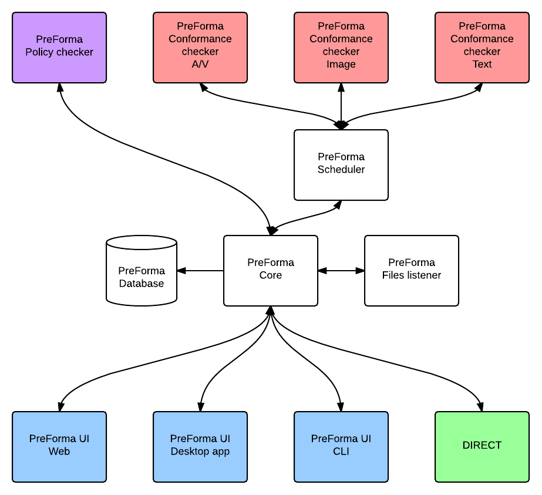

# PREFORMA Global Architecture

PREFORMA strives to offer access and ease to users with a structure that operates similarly and efficiently cross-platform and functions in both an online and offline capacity within different interfaces.

## Architecture schema

## Common to all elements

All elements can be installed on the same server or on different servers. This will be dependent on the expected workload and anticipated points of access. The flexibility of the architecture allows for a single user to either use the shell on one computer or to use it on multiple computers, depending on scalability and need. A distributed system can be set up to allow the implementation checker to process large files more quickly than when working on a single machine. This architecture offers this ability with relative ease for the user. In addition to added speed, this build of scalability within the implementation checker increases its capacity to function reliably within various anticipated workflows. 

### File access

#### File access using CLI

To place a file into the checking system, a user may execute the CLI name file manually or they can asynchronously run the file and test for its readiness. If the files are passed in a batch format, the reports can be later retrieved by manually requesting updates from the Core.

#### File access using GUI
 
To place and use a file through the checker’s GUI, both technical and non-technical users will work within windows and dialog boxes that enable them to navigate to, open, and load system files directly within the interface. A standard open dialog box will search for and load files for processing within the software. The GUI runs within a human-readable, interactive environment with visually intuitive access to the file checking process. In addition to allowing direct access to checking individual files, scheduled batch file checking via special folders residing on the user’s computer/network can also be enabled directly within the GUI.

#### File access using Web
 
To place and check files through the web-based browser platform, the process will be similar to working within the implementation checker’s GUI. In this case, file loading will function visually, as with the GUI platform, but within the specific web browser’s user interface (UI) and without the user having to directly download the software. Local network access will power the checker within the browser (Firefox, Chrome, or IE). Similar to the CLI and GUI, the web-based (server-client) platform allows for individual file loading and checking (via a visually intuitive designed interface) as well as enabling the capability of calling up batch-scheduled checks directly via the UI.

#### Common to all

Files can be copied to a special folder somewhere on the user’s computer or local network. This folder can then be set to regularly check for new files at defined intervals and process the files accordingly. This function can be set up within any of the three checker access methods (CLI, GUI, and Web UI).

### File processing

The architecture allows for two modes of file processing: Direct access and asynchronous. Through enabling both processes, users can choose to have the checker handle individual files or have it process them in batches. Direct access allows for files to be processed one at a time, while asynchronous allows for files to be processed in batches and returned to at a later time.

### Internet Access

The architecture does not require direct internet access. Users can work with any version (CLI, GUI, and Web UI) offline as long as it is installed on a user’s machine (or distributed machines). In this case, for each deployment platform the version is installed and being used on, the user will be able to create an executable even when they are not connected to the internet. The web-browser UI can be run using a local network access.

### Automation

PREFORMA includes the option of automated checking, allowing for users to receive notifications when new files are placed or come into the system.

A user can set up a system on the Core which will configure the system to run scheduled automatic checks for new files and batches. This system can be accessed and configured within the user interface to run on a timed and defined schedule.

### Batching

A user also has the option to set up batch file checking and validating and schedule it to be sent through to the checker at any later point in time. These large tasks can be set up to perform according to a defined schedule. All versions of checker access (CLI, GUI, and Web UI) will have the capacity to enable this function, either through the command line or directly through the interface.

### Prioritization

A user can also prioritize the checker to queue individual items and scheduled checks based on a defined priority level, with a lower priority placed on periodical checks. This function will be available through all versions of the checker (CLI, GUI, and Web UI). Priority levels for checks can be divided by High (for checks requested by user), Normal (for automated checks), Low (for periodical checks) requests.

### 

PREFORMA allows users to load and edit configurations within a REST API configuration that will run via HTTP.

The Web-based system allows users to work both on and outside of the network as well as locally if they choose. If the user chooses to work locally, they will have access to the application server directly. This operation runs via a HTTP Daemon. 

Users will have access to this web-based user interface for basic management. This will allow users to see the list of files, as well as the processes and checking happening to each of these files. Users will also be shown demarcation of which files pass testing successfully. The web user interface (UI) will function across 3 major web-based browsers (Firefox, Google Chrome, and Internet Explorer). 

## Core (Controller)

The Core serves as communication between all plugins within and outside of the Conch system and between all layers. The Core is the main service and runs in a passive, background mode. For example, if a user updates The Core, it will have no effect on the functionality of other systems. If a user begins using MySQL while running the implementation checker and decided to change to PostgreSQL, the Core could be adapted to address such a change. In essence, while components shift, the Core functions to present the data to all databases consistently and similarly and can adapt to different components.

The Core has several major functions:

* controls the checkers and manages data for the User Interface
* waits for commands from the Files listener and User Interface
* sends commands to the scheduler for file-checking
* launch periodical checks
* communicates with the database to store and retrieve data from the checkers
* sends data to DIRECT

The Core supports the following requirements:

- Scheduling
- Statistics
- Reporting
- User management
- Policies management

Interface :

* Scheduler : Advanced Message Queuing Protocol
* Policy checker / Files listener / User Interface / DIRECT : REST API
* Database : native driver

Programming language : C++

## Database

The Database is responsible for storing the associated metadata and results of the implementation checker, including the policy checker rules and the user rights management. All specific technical metadata and conformance checking results for each type of file format are sent back to the Core before being stored within the database.

* store metadata and results of the implementation checker
* store the policy checker rules
* user rights management
* trace (optionally)

Interface :

* Core : native driver

Software :

As the main purpose of the software build is to store flat datas, it's more suitable to use a document oriented database (NoSQL). However, a more traditional relational database can also be used.

There are various potential database management system options, contingent upon the open source licensing requirements:

* Relational database : MySQL (GPLv2) / PostgreSQL (PostgreSQL License) / SQLite (Public domain)
* Non relational database : MongoDB (AGPLv3) / Elasticsearch (Apache license 2)

## Scheduler

The Scheduler element is a form of software "middleware" that distributes the files to be checked across the implementation checkers by using a message broker interface. It translates the file data into one unified language for access within all aspects of the software. The Scheduler also controls priority levels for file checking.

* distributes files
* translates file data into unified language
* batch processing
* priority

The scheduler can take care of the priority function within the implementation checkers :
* high : for checks requested by user
* normal : for automated checks
* low : for periodical checks

Interface :

* Core : Advanced Message Queuing Protocol
* Checkers : Advanced Message Queuing Protocol

Software :

RabbitMQ (MPL 1.1) / Gearman (BSD) / ZeroMQ (LGPL v3)

## Files listener

The Files listener is a background process that listens for new files available for checking and validating. Automated checking, set up through the software, will notify when new files come into the system. Each time a new file is available, or if a file is modified, an event is sent to the Core which automatically requests a check.

Different solutions can be implemented depending on the file’s storage and operating system. Implemented solutions can include an inotify notification system API for a Linux kernel or kqueue/kevent for a BSD kernel or files directory scanning.

* Automated checks

Programming language : C++

## implementation checker and Metadata Grabbing Module

This module can utilize one or more checkers for each media type. As the implementation checker’s process could potentially run for a long time, we use an asynchronous system based on a messaging system in order to not lock up the whole process. Metadata and conformance checking results for each file are sent back to the Core to be stored within the database.

* runs the conformance tests for the different types of media files
* grabs metadata (used for policy checking)

See [Checker Architecture](CheckerArchitecture.md) for more details.

Interface :

* Scheduler : Advanced Message Queuing Protocol

Programming language : C++ for MediaArea, depends on other participants for JPEG 2000, TIFF, PDF.

## Policy checker

The policy checker serves to run tests on all metadata grabbed by the implementation checker and metadata grabbing module (the Checker). A vocabulary of technical metadata for each file format and media type will be created for the policy checker’s functions.

* runs the policy tests for the different type of media files.

Interface :

* Core : REST API

Programming language : C++

## Reporter

Within each of the developed user interfaces there will be ways to export raw metadata and human-readable JSON/XML/HTML/PDF reports after the conformance checking process. The reporter will define and express how a file’s checked metadata corresponds to the validation result standards.

* exports a machine readable report, including preservation metadata for each file checked
* exports a report that allows external software agents to further process the file
* exports a human readable report
* exports a "fool-proof" report which also indicates what should be done to fix the non-conformances

The machine readable report will be produced using a standard XML format, implemented by all implementation checkers working within the PREFORMA ecosystem. This allows the reported module to combine output from multiple checker components into one report while also including sub-elements within the report that will address each conformity check. The report will be based on a standard output format that will be made by the consortium.

The human readable report summarizes the preservation status of a batch of files as a whole, reporting to a non-expert audience whether a file is compliant with the standard specifications of the format or institution while also addressing improvements in the creation/digitisation workflow process.

Interface :

* Core : REST API

Programming language : C++

Will use PoDoFo (LGPLv3+) for PDF export

## User interface

The User interface (UI) is the shell component that allows direct interaction between users (or other systems) and the PREFORMA components:

* displays test results
* controls the Core
* allows metadata (descriptive and structural) to be edited
* edit configuration (periodical checks, policy checker, user rights)

Conch will provide three different options for a human interface in order to introduce maximum user interaction and flexibility within the implementation checker. These three interfaces are:

- CLI (Command line interface)

A command line interface will be functional on nearly all types of operating systems and platforms, including those with very little graphical interface support. CLI use allows for integration into a batch-mode processing workflow for analyzing files at scale.  This interface is more intended for technical and expert users and for non-human interaction.

- GUI (Graphical user interface)

A Graphical user interface (GUI) will be developed and provided for both expert and non-expert users. The GUI, being based on Qt, has the strength of being versatile between operating systems and does not require additional development time to provide support for multiple platforms. The GUI can function similarly across all deployment platforms.

- Web UI (server/client)

An optional Web-based user interface (UI) will also be provided for both expert and non-expert users. In order to run this option, an internet access will not be needed or required.  Local network access will power the checker within the user’s chosen web-browser. The web interface will provide access to conformance checks without having to directly download and install the software.

Interface :

* Core : REST API

Programming language :

* CLI : C++

* GUI : C++ / Qt (LGPLv3+)

* Web : PHP/Symfony (MIT)