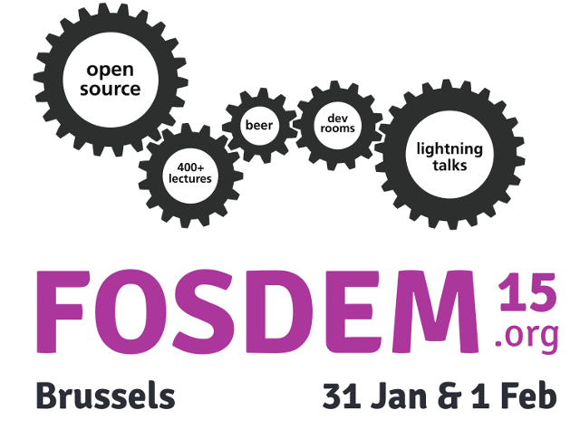

 
# Contact

 
#### Open source feedback and participation of all kinds and from any interested party or institution is encouraged and can be made through GitHub or contacting the team directly at [info@mediaarea.net](mailto:info@mediaarea.net).
  
 
### Development

All development is hosted on our [Github repository](https://github.com/MediaArea/MediaConch). Comments and suggestions for improvement can be made via our [Issues tracker](https://github.com/MediaArea/MediaConch/issues). Details and a contribution guide can be located in the README of our Github page.

### Mailing list

Stay up-to-date with the project by [joining our mailing list.](https://docs.google.com/forms/d/1yWJZB6bt19rMrjYEOrYgKRK5sFjd4p7ZKDdXiKZrCTI/viewform?usp=send_form)

## Outreach 

<table>
<tr>
  <td colspan="3">
    The MediaArea team is active in the open source community and actively presents their work on MediaConch.
  </td>
</tr>
<tr>
  <td>
    <ul>
      <li>
      March 2015 
      Jérôme Martinez and Dave Rice 
      Brussels, Belgium
      </li>
    </ul>
  </td>
  <td style="width:33%; vertical-align: middle;">
    
  </td>
  <td style="width:25%; vertical-align: middle;">
    <a href="http://www.preforma-project.eu/design-phase-1-final-workshop.html">Conference page</a> <a href="http://mediaarea.github.io/MediaConch/Outreach/Slides">Slides</a>
  </td>
</tr>
<tr>
  <td>
    <ul>
        <li>
        February 2015 
        Ashley Blewer 
        Portland, OR, USA
        </li>
    </ul>
  </td>
  <td style="width:33%; vertical-align: middle;">
    
  </td>
  <td style="width:25%; vertical-align: middle;">
    <a href="http://wiki.code4lib.org/2015_Lightning_Talks">Conference page</a> <a href="http://ablwr.github.io/c4l_preforma/#/">Slides</a> <a href="https://www.youtube.com/watch?v=G7kgcZh2zeY&t=2h20m48s">Video</a>
  </td>
</tr>
<tr>
  <td>
  <ul>
      <li>
      January 2015 
      Dave Rice 
      Brussels, Belgium
      </li>
  </ul>
  </td>
  <td style="width:33%; vertical-align: middle;">
      
  </td>
  <td style="width:25%; vertical-align: middle;">
  <a href="https://fosdem.org/2015/schedule/event/enabling_video_preservation/">Conference page</a> <a href="https://fosdem.org/2015/schedule/event/enabling_video_preservation/attachments/slides/746/export/events/attachments/enabling_video_preservation/slides/746/preservation.pdf">Slides</a> <a href="http://video.fosdem.org/2015/devroom-open_media/enabling_video_preservation.mp4">Video</a>
  </td>
</tr>
</table>

## Community Interviews

In December 2014, MediaArea started conducting interviews with FFV1, Matroska, and LPCM stakeholders in order to collect feedback and insights from the archives community.  To date, interviews have been conducted with:

<ul>
  <li><a href="/interviews/InterviewLewetzBubestinger.html">Hermann Lewetz, Peter Bubestinger; Österreichische Mediathek</a>
    </li>
  <li><a href="interviews/InterviewHenderson.html">Ian Henderson; UK National Archives</a>
    </li>
  <li><a href="interviews/InterviewKummer.html">Christophe Kummer; NOA</a>
    </li>
  <li><a href="interviews/InterviewBlood.html">George Blood; George Blood, L.P.</a>
    </li>
</ul>
